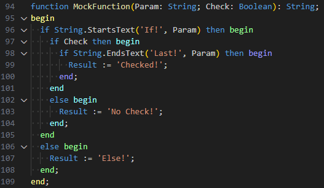

# Pascal Rainbow Block

Highlight block defining keywords with rainbow colour depending on the level it's in.

The highlighted keywords are:

- `begin`
- `end`
- `try`
- `except`
- `finally`

Compatible with Pascal and DelphiLSP extension. Haven't test with OmniPascal.

## Roadmap

Currently this extension is still in active developments. Feedbacks will be greatly appreciated.

Next features to implement are:

1. Add configuration to define the color used.
2. Add light mode.
3. Allow the highlighting of preceding keywords such as `if`, `else` and `class`.
